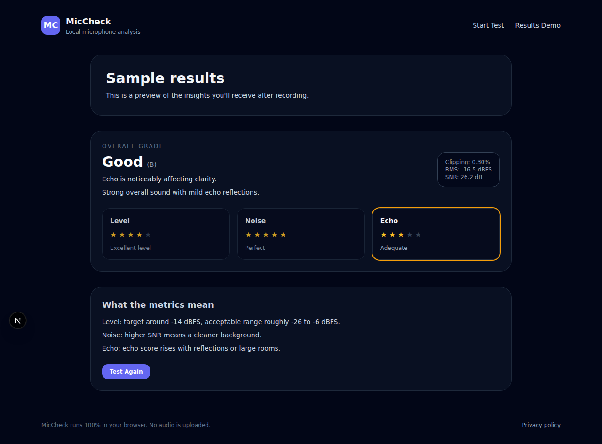

# MicCheck

[](https://github.com/miccheck/miccheck/actions/workflows/ci.yml)

MicCheck is a browser-based microphone quality analyzer that records a short sample locally, analyzes it in the browser, and provides actionable feedback. Audio never leaves the device.



## How It Works

Record → Analyze → Fix

- **Record:** Capture a 5–7 second microphone sample in the browser.
- **Analyze:** Measure clipping, volume, noise floor, and room echo locally.
- **Fix:** Get a letter grade and the single most impactful improvement.

## Features

- 5–7 second recording flow with real-time meter
- Local analysis for clipping, volume, noise, and room echo
- A–F grade with one prioritized fix
- Works across modern desktop and mobile browsers

## Supported Browsers

| Browser | Desktop | Mobile |
| --- | --- | --- |
| Chrome | ✅ | ✅ |
| Edge | ✅ | ✅ |
| Firefox | ✅ | ✅ |
| Safari | ✅ (14+) | ✅ (14+) |

## Privacy

MicCheck runs entirely in your browser—audio never leaves your device. Review the full policy in [docs/PRIVACY.md](docs/PRIVACY.md).

## Local Development

```bash
npm install && npm run dev
```

Then visit `http://localhost:3000`.

## Tech Stack

- Next.js 14 (App Router) + TypeScript
- Tailwind CSS
- Turborepo workspaces
- Vitest

## Project Structure

- `apps/web`: Next.js frontend
- `packages/audio-core`: low-level PCM utilities and browser helpers
- `packages/audio-metrics`: analysis and scoring engine
- `docs`: privacy and compatibility docs
