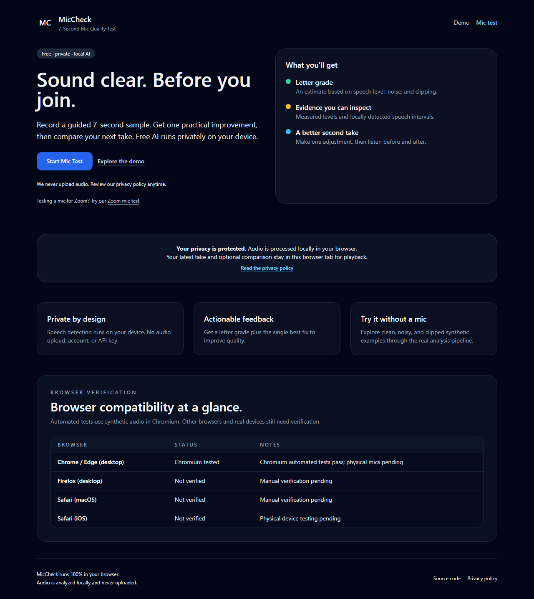
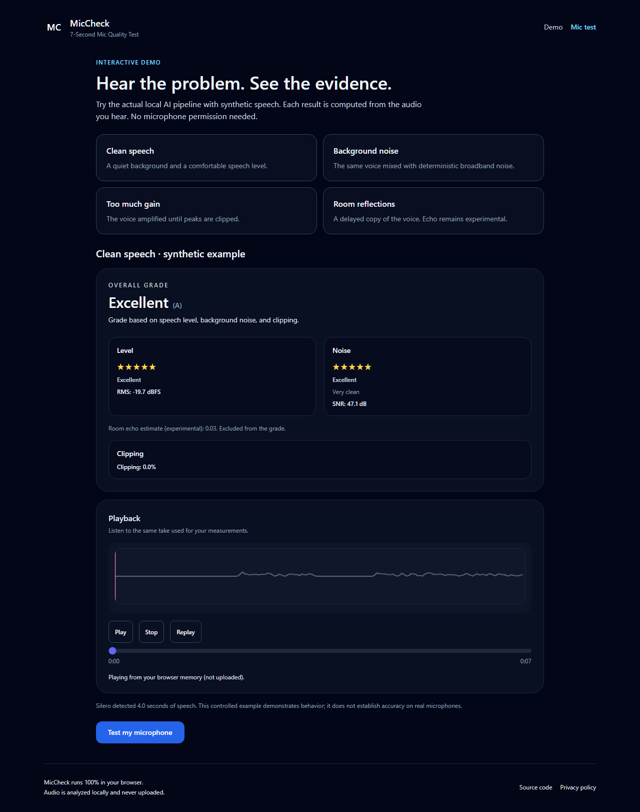
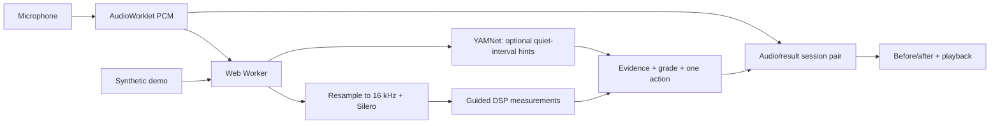

# MicCheck

[](https://github.com/abulhawa/miccheck/actions/workflows/ci.yml)

A private microphone setup coach: record seven seconds, inspect the evidence, make one adjustment, and compare your next take. Neural speech detection and optional background sound classification run locally in a browser worker.



## Try it

```bash
npm ci
npm run dev
```

Use Node.js 22 or 24 and npm 11.8.0. Open http://localhost:3000. `/results` runs clean, noisy, clipped, and reverberant synthetic examples without microphone access. `/test` records two seconds of quiet followed by five seconds of speech. Microphone access requires localhost or HTTPS.

The root development command builds workspace dependencies and then watches their TypeScript output and the AI worker. Refresh and re-run analysis after changing worker code. Production: `npm run build`, then `npm --workspace apps/web run start`.

## What it does

- Captures raw mono PCM through AudioWorklet where available; requests disabled browser audio processing and reports the settings actually supplied.
- Uses **Silero VAD v5** to find speech. It withholds grades when speech or the quiet calibration interval is insufficient.
- Estimates speech level, background noise, SNR, clipping, and mains hum; gives a grade and practical setup advice.
- Optionally uses **YAMNet** for a small set of background sound hints, with an unknown outcome instead of forcing a label.
- Keeps audio and results paired across refresh; supports before/after metric comparison and exclusive A/B playback.
- Includes keyboard focus, reduced-motion support, mobile layout checks, and a microphone-free demo with matching audio and computed results.



## Free AI and privacy

No AI subscription, paid API, account, or key is needed. Model files and their licenses are included; build preparation verifies their SHA-256 checksums and copies the pinned ONNX runtime. Models load from the same site and inference uses the visitor's CPU. Hosting and bandwidth can still cost the person deploying the site; running locally does not require a paid service.

Audio is never uploaded by the application. The latest take and a comparison baseline stay in this tab's session storage, with an in-memory fallback when storage is denied. Analytics are off by default. [Privacy details](docs/PRIVACY.md) · [model provenance and licenses](apps/web/public/models/README.md).

## Architecture


```mermaid
flowchart LR
  Mic[Microphone] --> Capture[AudioWorklet PCM]
  Demo[Synthetic demo] --> Worker
  Capture --> Worker[Web Worker]
  Worker --> VAD[Resample to 16 kHz + Silero]
  VAD --> DSP[Guided DSP measurements]
  Worker --> YAM[YAMNet: optional quiet-interval hints]
  DSP --> UI[Evidence + grade + one action]
  YAM --> UI
  Capture --> Pair[Audio/result session pair]
  UI --> Pair
  Pair --> Compare[Before/after + playback]
```

Next.js 16 / React / TypeScript / Tailwind provide the interface; Turborepo manages `apps/web`, `packages/audio-core`, and `packages/audio-metrics`. ONNX Runtime Web and TensorFlow.js execute the models. There is no audio-processing backend.

## Verification

```bash
npm run test
npm run build
npm run lint
npm audit
npx playwright install chromium
npm --workspace apps/web run test:e2e
```

Vitest enforces coverage thresholds. Playwright exercises real local models, synthetic microphone capture, released tracks, paired refresh recovery, comparison playback, and mobile layout. CI runs the checks and retains browser traces on failure. See the [synthetic benchmark](docs/BENCHMARK.md), [methodology](docs/TECHNICAL_METHODOLOGY.md), and [original audit with resolution status](docs/PORTFOLIO_REVIEW.md).

## Limits

This is a portfolio prototype, not a calibrated acoustic instrument. The grade reflects heuristic level/noise/clipping thresholds, not microphone price or professional certification. Echo remains experimental and cannot affect the grade or recommend purchases. Diagnostic certainty is at most medium and drops with processed, encoded, or unknown capture settings. Background labels are tentative and are not probability estimates.

Automated Chromium tests use synthetic audio. Real microphone hardware, speakers, rooms, Firefox, and Safari still need manual evaluation. No cross-browser or real-world accuracy claim is made. See [compatibility](docs/COMPATIBILITY.md) and the [release checklist](docs/RELEASE_CHECKLIST.md).
